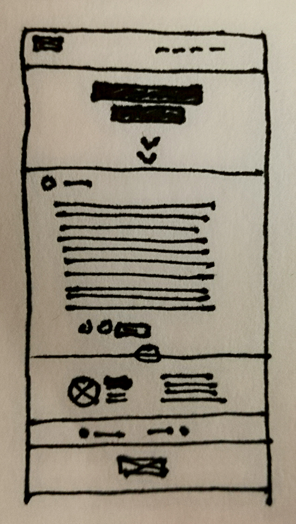
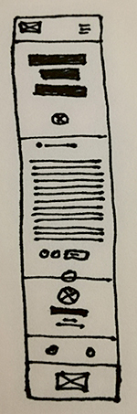

# Ejercicio 10 - Maquetación

https://kimlouu.github.io/ejercicio10/

## Maquetado Artículo Barbershop

### Requerimientos generales:

- Article Page Responsive (5 formas de cuidar el corte del cabello)
    -
- Navbar con navegación de 5 elementos + brand
    - Nosotros
    - Trabajos
    - Blog
    - Horas
      Contacto
- 4 Secciones:
    - Header con Título de artículo y ancla de desplazamiento
    - Cuerpo de artículo con fecha y botones de interación
    - Author con foto datos y descripción
      Article-nav con artículo siguiente y anterior
- Footer:
    - Logo

### Requerimientos específicos:

- Icons:
    - Proporcionados: down-arrows, calendar, like, share
      Faltantes: comment, left-arrow, right-arrow, user (Font-awesome)
      interaction-icons: color:white, background:#707070, rounded
    - down-arrows: color:white
    - calendar, user: color:#707070, rounded, border:1px solid:#707070
- Textos
    - Cuerpo y descripción de autor: Lorem
    - Proporcionados: Todos los demás
- Grid system:
    - Bootstrap
        - Navbar: 3 col - 6 col
        - Header: 12 col
        - Article-body: 10 col
        - About us title: 12 col
        - Interaction-icons: 4 col
        - Author: 3col 3col 6col
        - Article-nav: 5 col - 5 col
          Footer: 12 col

### Requerimientos visuales:

- Layout:
    - Bootstrap
- Tipografía:
    - H1: Playfair Display black italic
    - Date: Playfair Display regular
      author p: Roboto light
    - p: Roboto regular
- Colores:
    - Navbar, footer, author-name: #121619
    - Icons-background icons p article-nav: #323333
    - Date, article-nav-background: #707070
    - p a #d56c6a
      h1, background-color, nav-bar-nav, interaction-icons: White
- Imágenes:
    - Están todas
- Icons:
    - Font-awesome

### Sketch Desktop Version:

### Sketch Mobile Version:

### Estructura:

- navbar
- main
    - header
    - section article-body
    - section author
    - section article-nav
  footer

### Clases:

- #navbar
    - navbar__brand
    - navbar__navigation
- #header
      header__icon
- article-body
      article-body__entry
    - article__date
          article__date--icon
      article__interaction
          article__interaction--icon
      article__btn
          article__btn--comment
- author
    - author__img
      author__inner
      author__inner--description
- article-nav
      article-nav__icon
    - article-nav__text
- footer
      footer__brand
